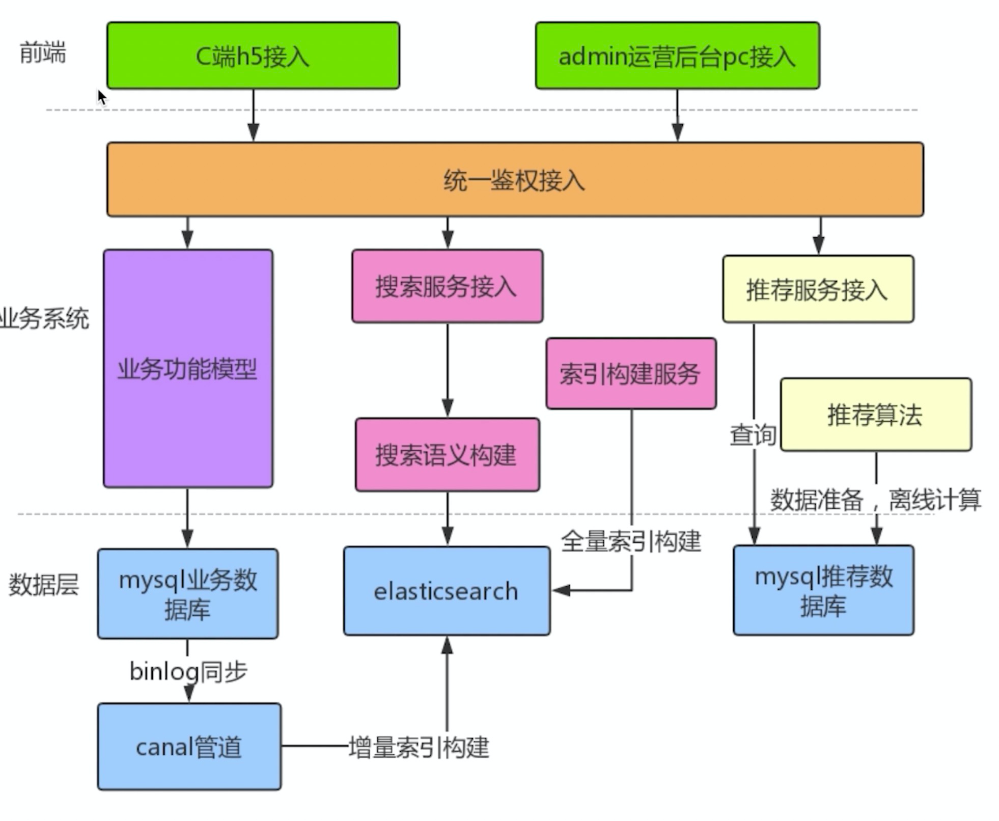

# recommend-system
   
基于Spark和ElasticSearch搭建的商铺推荐系统

## 系统介绍

### 整体架构

系统整体架构如下：

### 技术栈

- JDK1.8
- SpringBoot：后端开发框架
- ElasticSearch：搜索算法实现
- Spark：推荐算法实现
- Logstash: 监听MySQL日志并将数据添加到ES
- Canal：数据增量中间件

### 开启应用

- 配置MySQL
- 配置ElasticSearch
- 根据Resource中的DDL和DML文件，进行数据库的新建

## 推荐系统

### V2.0

一个完善的推荐系统需要包含召回->排序->业务规则调整

- 召回：指在海量的待推荐数据中过滤出较为符合对应用户及场景的推荐数据候选集。召回内分为：
    - 在线召回：实时运行召回算法，从海量数据中拿出对应的候选数据集
    - 离线召回：离线运行召回算法，从海量数据中拿出对应的候选数据集并预存入某种存储中，供在线系统直接拿取对应场景的召回数据。

  由于召回是从海量数据中过滤出一部分数据，运算时效往往很长，因此一般都采用离线召回算法。 

  本模型中选择个性化召回算法ALS：[ALS算法](https://www.cnblogs.com/mstk/p/7208674.html)

- 排序：在召回出的候选推荐数据集内利用算法给每个结果集打分，最终排序出对应候选集内top n的数据并返回外部系统。排序内分为：
    - 在线排序：实时运行排序算法，给对应召回的数据集打分并输出
    - 离线排序：离线运行排序算法，算好对应的数据打分

  由于排序往往结合了特征工程，需要根据当前用户和场景的特征作为输入做打分，不太现实离线的给所有用户的所有特征打分后预先存在某个存储中（数据量太大，一般为用户数量*商品数量）。因此一般都采用在线排序，由于召回已经过滤了绝大部分数据，因此实时的打分性能是可以接受的

  本模型中选择排序算法LR：[LR算法](https://blog.csdn.net/hzwaxx/article/details/83861782)

- 使用Spark的MLlib进行实现

- resource目录下的data中包含了已经训练成功的lrmode和alsmode，以及用于训练的假数据

## 搜索系统

### V2.0

- 通过logStash在MySQL和ES之间逆行全量索引和增量索引的构建
- 在Service层接入ElasticSearch的服务，通过RESTful API的方式发送搜索请求，并得到对应文档结果
- 搜索的算法采用了低价匹配等多种搜索算法的结合
- 使用alibaba的Canal中间件，可以基于日志在ES和MySQL之间进行准实时的索引建立，效果比logStash更好
